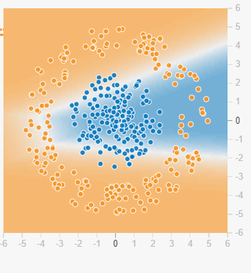
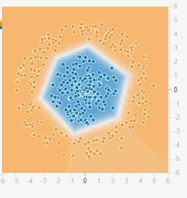
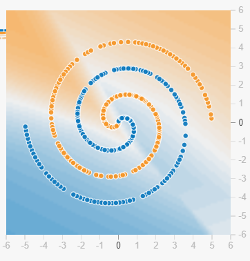
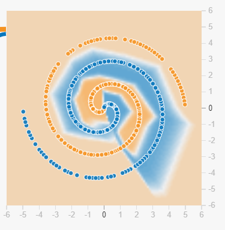
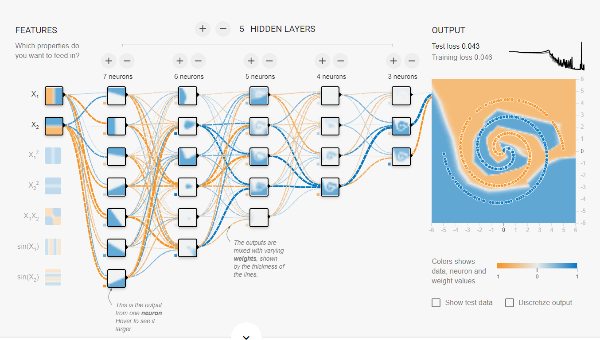

# Tensorflow Playground Analysis

I chose the tensorflow playground for this intuition report mainly cause how well it visualizes the inner neurons, right down to a visualization of the neuron's activation function. This quickly interested me because I could see in near real time how each neuron reacted to my experiments. The other motivation for picking this my knowledge on how the layers interact is fuzzy at best and I had hoped playing around with this would help.

The first set of experiments I did were with a relatively simple dataset. I set most other variables to some sensible defaults. Activation function was RelU, 20% of the data were reserved as validation data. And the parameters I selected were just the data x1 and x2.

I wanted a baseline of how the model would perform with just 1 hidden layer with 1 neuron. Unsurprisingly, it did poorly with a validation loss of 0.443. It was interesting that the hidden layer's neuron's activation a essentially just a linear model. With no other layers, the output model was also just a linear line. This obviously would not be the most accurate model. 

Things improved considerably with 2 neurons in the hidden layer. Validation loss improved to 0.270 and the model changed from a linear layer to a 2d space. I found this to be quite interesting as this lined up quite well with my understanding of how RelU introduces non-linearity to a combination of linear models. We can sort of see that the lines between the classification spaces in the figure below are two linear lines that kind of converging at one point. Before training, this convergence point is random and arbitrary but after just 50 epochs of training, the model has optimized its classification to capture as many points as possible.

However we still see several blue data points in orange zones and orange data points in blue zones. Hence we see a limitation to just using two neurons in the hidden layer. Hence my intuition is that to accurately approximate the function, we'd need to bump up the number of neurons.

So I kept tinkering with the number of neurons until I found that 4 neurons in the hidden layer were enough to estimate the function with a reasonable degree of accuracy with a validation loss of 0.004. We can see that this result is also a non-linear combination of linear models, but one with more lines that much up to be a polygon.

While this was great for a case with simple data with clear clusters, I couldn't help but wonder how the model would perform if given more complex data. So I picked the most complex data in the tensorflow playground where the data points were arranged in a interweaving spiral and then I trained by 3 layer with 4 neurons model against it. This time it didn't do so well with a validation loss of 0.475.

Clearly a simple combination of linear layers with RelU would not be enough to estimate such a complex data shape. To allow our model to learn more complex shapes, I figured we needed to add more layers. With just a bit of tinkering I found this to be true, a mode with 4 layers transformed the classification shapes to be more complex than straight lines converging. However the model also began to overfit very quickly and the performance was not much better (loss was 0.472). 

However I felt that I was on the right track and adding more complexity would yield better results. For example with 5 layers, the validation error dropped to 0.2 and the model was starting to resemble a spiral.

Finally with 7 layers, I was able to reduce the validation error to 0.043. Here is the screenshot of the entire model.

It is really interesting to see how in each of the layers the models become more and more complex shapes and that the final shape approximates the data as well as I would expect. However the plot of the loss curve seems very erratic even though loss is decreasing. I am assuming the model is not overfitting as the overall loss is decreasing, so I will have to investigate further on this. 
